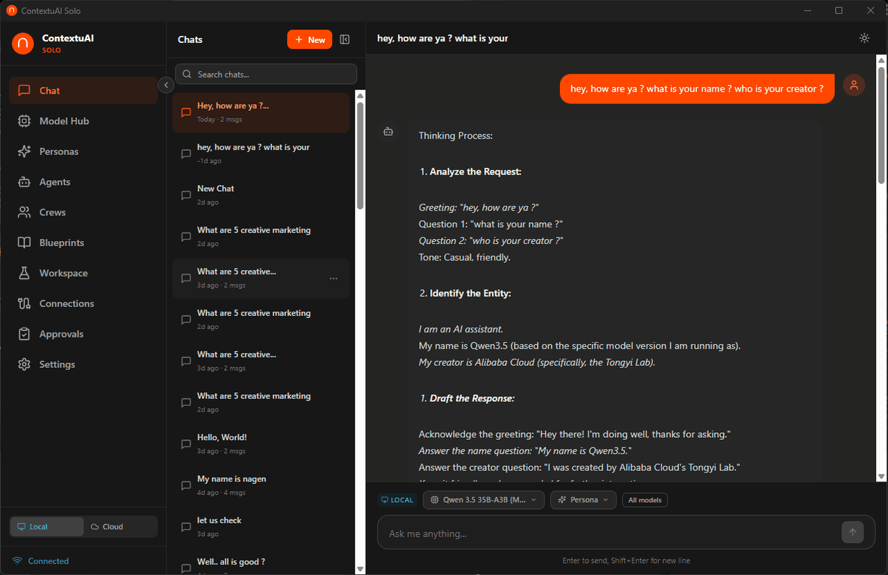

# ContextuAI Solo

### The AI team behind every solo business

[](https://contextuai.com/solo)
[](LICENSE)
[]()
[](https://tauri.app/)
[](https://react.dev/)
[](https://fastapi.tiangolo.com/)
[](https://sqlite.org/)

You're one person running a business. You need a marketing strategist, a financial analyst, a legal reviewer, a content writer, and a dozen other specialists — but you can't afford to hire them.

**Now you don't have to.** ContextuAI Solo puts an entire team of 81 AI business experts on your desktop. They research, write, analyze, review, and publish — individually or as coordinated crews. And everything stays private on your machine.

<p align="center">
  <a href="https://github.com/contextuai/contextuai-solo/releases/latest"></a>
</p>

> **Ready to try it?** Download the installer for your platform from the [Releases page](https://github.com/contextuai/contextuai-solo/releases/latest) — Windows (.exe/.msi), macOS (.dmg), or Linux (.deb/.rpm). No build steps required.
>
> **New here?** Read the [User Guide](docs/user-guide/README.md) to get started, or the [Deep Strategy Playbook (PDF)](https://github.com/contextuai/contextuai-solo/releases/latest/download/ContextuAI_Solo_Deep_Strategy_Playbook.pdf) for a full overview.

> **Which model should I run?** For best results, download **Qwen 3 8B** (8 GB RAM) or **Qwen 3 14B** (16 GB RAM) from the Model Hub. These deliver strong results for business writing, analysis, and social media content. The smaller 1B models work for quick tests but won't match the quality of larger models.



<details>
<summary><strong>View all screenshots</strong></summary>

| | |
|:---:|:---:|
|  **Dashboard & Chat** |  **Model Hub** |
|  **Models Installed** |  **Personas** |
|  **Create Persona** |  **Agent Library** |
|  **Create Agent** |  **Crews** |
|  **Blueprints** |  **Create Blueprint** |
|  **Workspace** |  **Connections** |
|  **Approvals** |  **Settings** |

</details>

---

## What can Solo do for you?

### Ask your AI team for help — just like you'd ask a colleague

| You need to... | Solo gives you... |
|----------------|-------------------|
| Review a contract before signing | A **Legal Counsel** agent that flags risks and suggests revisions |
| Write a LinkedIn post that sounds like you | A **Content Strategist** who knows your brand voice |
| Forecast next quarter's revenue | A **Financial Analyst** who structures projections and assumptions |
| Research a new market before entering | A **Competitive Intelligence Analyst** who maps the landscape |
| Prepare a board presentation | A **CEO Strategic Advisor** who structures the narrative |
| Audit your website's SEO | An **SEO Specialist** who identifies gaps and priorities |
| Draft a job description | An **HR Talent Acquisition** specialist who writes to attract |
| Plan a product launch | A **crew** of Product Manager + Content Strategist + Social Media Manager working together |

### Build crews that work together

Don't just ask one agent — assemble a team. A crew of 3–5 agents can research, draft, review, and refine a deliverable while you focus on other work.

**Example: Quarterly Business Review**
1. **Financial Analyst** pulls together the numbers and trends
2. **Data Analyst** creates visualizations and insights
3. **CEO Strategic Advisor** frames the narrative for stakeholders
4. **Copywriter** polishes the final document

You define the crew once. Run it whenever you need it.

### Publish to your channels

Connect Solo to **Telegram, Discord, Reddit, LinkedIn, Twitter/X, Instagram, and Facebook**. Your crews can draft and post content — with optional approval gates so nothing goes live without your sign-off.

---

## Who is Solo for?

Solo is built for people who run a business with a small team — or no team at all:

- **Freelancers and consultants** who handle client strategy, proposals, and deliverables alone
- **Solo founders** building a company and wearing every hat — marketing, finance, legal, product
- **Small agency owners** who need to scale output without scaling headcount
- **Professionals with sensitive data** — client financials, legal documents, HR records — who can't risk sending it to the cloud

---

## Your data never leaves your machine

Solo runs 100% on your desktop. No accounts. No cloud sync. No telemetry.

- **AI models run locally** on your CPU — download once, use forever, no internet required
- **All data stored locally** in SQLite — conversations, agents, crews, everything
- **No sign-up, no login** — you're the admin, always
- **Bring Your Own Key** — optionally connect Anthropic, OpenAI, Google, or AWS Bedrock when you need cloud-scale power

Your client proposals, financial models, legal reviews, and business strategies stay on your laptop. Period.

---

## 93 Business Agents, Ready to Work

Solo ships with specialized agents across every business function:

| Department | Your AI team members |
|------------|---------------------|
| **C-Suite** | CEO Strategic Advisor, CFO Financial Strategist, CTO Technology Advisor, CMO, COO, CHRO, and 6 more |
| **Marketing & Sales** | Content Strategist, Copywriter, SEO Specialist, Social Media Manager, Sales Engineer, and 6 more |
| **Finance & Operations** | Financial Analyst, Pricing Strategist, Controller, Supply Chain Analyst, Risk Manager, and more |
| **Legal & Compliance** | General Counsel, Privacy Officer, Contract Specialist, IP Strategist, Compliance Officer |
| **HR & People** | Talent Acquisition, People Operations, Compensation Analyst, L&D Specialist, Org Development |
| **Data & Analytics** | Data Analyst, Data Scientist, BI Analyst, Analytics Engineer, Data Governance Specialist |
| **Design & UX** | UI Designer, UX Researcher, Brand Designer, Motion Designer, Design System Architect |
| **Product Management** | Product Manager, Agile Coach, Technical Writer, Scrum Master, Business Analyst |
| **IT & Security** | SOC Analyst, Penetration Tester, IAM Specialist, Network Architect, IT Support Lead |
| **Startup & Venture** | Fundraising Advisor, Growth Hacker, Pitch Deck Architect, MVP Architect, and 6 more |
| **Social Engagement** | Social Media Responder, Brand Voice Guardian, Sentiment Analyzer, Lead Qualifier, and 8 more |
| **Specialized** | Solutions Architect, Developer Advocate, AI Ethics Advisor, Sustainability Officer, and 5 more |

Every agent comes with a detailed system prompt, recommended tools, and domain expertise. Use them as-is or customize them for your business.

---

## 37 Local AI Models — One Click, No Subscriptions

Download a model. Click run. That's it. No API keys. No internet. No monthly bills.

Solo auto-detects your hardware and recommends the right model:

| Your RAM | What you can run |
|----------|-----------------|
| 4 GB | Qwen 3.5 0.8B, Gemma 3 1B, Llama 3.2 1B |
| 8 GB | Qwen 3 8B, DeepSeek R1 7B, Mistral 7B, Qwen 2.5 Coder 7B |
| 16 GB | Qwen 3 14B, Phi-4 14B, DeepSeek R1 14B, Qwen 2.5 Coder 14B |
| 32 GB | Qwen 3 32B, DeepSeek R1 32B, Gemma 3 27B, Qwen 2.5 Coder 32B |
| 48+ GB | Llama 3.1 70B, DeepSeek R1 70B |

8 model families: **Qwen 3.5** / **Qwen 3** / **Qwen 2.5** / **DeepSeek R1** / **Gemma 3** / **Llama 3** / **Mistral** / **Phi-4** — covering general chat, reasoning, coding, creative writing, multilingual, and vision.

### Built-in Coding Server

Solo exposes an **OpenAI-compatible API endpoint** (`/v1/chat/completions`) on your localhost. Point VS Code, Cursor, or any OpenAI-compatible IDE at it and use Qwen 2.5 Coder or DeepSeek R1 as your local coding assistant — completely offline, completely free.

---

## Everything else you get

- **Multi-Agent Crews** — Assemble teams via a 5-step wizard with 4 execution modes: sequential, parallel, pipeline, or fully autonomous
- **10 Blueprint Templates** — Pre-built workflow templates across strategy, content, marketing, product, and research
- **Workshop Mode** — Run multi-agent brainstorming sessions with structured outputs
- **10 Persona Types** — Nexus Agent, Web Researcher, database connectors (PostgreSQL, MySQL, MSSQL, Snowflake, MongoDB), MCP Server, API Connector, File Operations
- **7 Platform Connections** — Telegram, Discord, Reddit, LinkedIn, Twitter/X, Instagram, Facebook with approval gates. See the [Connections Guide](CONNECTIONS-GUIDE.md) for setup
- **Brand Voice** — Define your business identity so every response sounds like you
- **Dark/Light Theme** — Easy on the eyes, day or night

---

## Download & Install

**[Download the latest release](https://github.com/contextuai/contextuai-solo/releases/latest)** — pre-built installers for all platforms, no build steps needed.

| Platform | Installer | How to Install |
|----------|-----------|----------------|
| **Windows** | `.exe` or `.msi` | Run the installer. If SmartScreen warns "Windows protected your PC", click **"More info"** → **"Run anyway"** |
| **macOS** | `.dmg` | Open the DMG, drag to Applications. Then run the command below in Terminal to clear Gatekeeper's quarantine flag, and launch the app normally |
| **Linux** | `.deb` / `.rpm` | `sudo dpkg -i contextuai-solo_*.deb` or `sudo rpm -i contextuai-solo-*.rpm` |

**macOS Gatekeeper fix** — After dragging the app to Applications, run this once in Terminal:

```bash
xattr -cr "/Applications/ContextuAI Solo.app"
```

Without this, macOS may silently refuse to launch the app (or show "app is damaged and can't be opened") because the `.dmg` isn't Apple-notarized yet. The command strips the quarantine attribute so the app opens normally on every launch afterward.

> **Note:** Windows SmartScreen and macOS Gatekeeper warnings are normal for new open-source software that isn't yet EV code-signed. You only need to bypass them once.

### First Run

1. The app launches a **Setup Wizard** that walks you through configuration
2. Download a free local model or enter an API key for a cloud provider
3. Start chatting, building agents, or assembling crews

### Beta Testers Welcome

This is an active beta — we'd love your feedback! If you run into any issues:

1. Check which version you're running (Settings page or the release you downloaded)
2. [Open a GitHub Issue](https://github.com/contextuai/contextuai-solo/issues/new) with the version number, your OS, and steps to reproduce
3. Feature requests are welcome too — tell us what agents or integrations you'd like to see

---

## Solo vs Enterprise

| Feature | Solo (Free) | Enterprise |
|---------|:-----------:|:----------:|
| AI Chat with Streaming | Yes | Yes |
| 93 Business Agents | Yes | Yes |
| 10 Persona Types | Yes | Yes |
| Multi-Agent Crews | Yes | Yes |
| Workshop (Brainstorming) | Yes | Yes |
| BYOK (Bring Your Own Key) | Yes | Yes |
| Local AI Models (GGUF) | Yes | Yes |
| Dark/Light Theme | Yes | Yes |
| 7 Platform Connections | Yes | Yes |
| SQLite (Local Storage) | Yes | -- |
| MongoDB + Cloud Infra | -- | Yes |
| Multi-User / Teams | -- | Yes |
| Role-Based Access Control | -- | Yes |
| SSO / MFA / SCIM 2.0 | -- | Yes |
| Analytics Dashboard | -- | Yes |
| Automations & Scheduling | -- | Yes |
| CodeMorph (Code Gen) | -- | Yes |
| Control Center (23 integrations) | -- | Yes |
| Enterprise DB Connectors | -- | Yes |
| Audit Logs & Compliance | -- | Yes |
| Dedicated Support | -- | Yes |

> **Solo** is free forever — [contextuai.com/solo](https://contextuai.com/solo). Interested in enterprise features? Visit [contextuai.com](https://contextuai.com) or email hello@contextuai.com.

---

## For Developers

<details>
<summary><strong>Architecture</strong></summary>

```
+-------------------+     +-------------------------+     +--------------------+
|                   |     |                         |     |                    |
|   Tauri v2 Shell  |     |   FastAPI Backend       |     |   AI Providers     |
|   (Rust)          |     |   (Python 3.11+)        |     |   (BYOK)           |
|                   |     |                         |     |                    |
|  +-------------+  |     |  +-------------------+  |     |  - Anthropic       |
|  | Vite + React|  | --> |  | SQLite Database   |  | --> |  - OpenAI          |
|  | SPA (1420)  |  | API |  | (via async adapter)|  |     |  - Google Gemini   |
|  +-------------+  |     |  +-------------------+  |     |  - AWS Bedrock     |
|                   |     |  Port 18741             |     |  - Local GGUF      |
+-------------------+     +-------------------------+     +--------------------+
```

- **Frontend**: React 19 SPA served by Vite dev server (port 1420) or bundled into the Tauri desktop shell
- **Backend**: FastAPI with SQLite via an async adapter layer that mirrors the enterprise Motor/MongoDB interface
- **AI Routing**: BYOK keys configured in the Setup Wizard; the backend routes requests to the selected provider
- **Data**: Everything stored locally in SQLite + localStorage. No telemetry. No cloud calls (except to your chosen AI provider).

</details>

<details>
<summary><strong>Project Structure</strong></summary>

```
contextuai-solo/
├── frontend/           # Tauri v2 + React 19 + Vite desktop app
│   ├── src/            # React components, routes, and lib
│   ├── src-tauri/      # Tauri Rust shell configuration
│   └── package.json
├── backend/            # FastAPI server (Python 3.11+, SQLite)
│   ├── app.py          # Application entry point
│   ├── adapters/       # Database, auth, storage, scheduler adapters
│   ├── routers/        # API route handlers
│   ├── services/       # Business logic and AI orchestration
│   └── requirements.txt
├── agent-library/      # Built-in agent templates (105 agents across 13 categories; engineering excluded from desktop → 93 visible)
├── docs/user-guide/    # Per-module user guides
├── run.sh              # One-command backend launcher (Linux/macOS)
├── run-tests.ps1       # One-click test runner (backend + frontend)
├── docker-compose.yml  # Docker-based development setup
└── LICENSE             # Apache 2.0 with Commons Clause
```

</details>

<details>
<summary><strong>Tech Stack</strong></summary>

| Layer | Technology |
|-------|-----------|
| **Desktop Shell** | [Tauri v2](https://tauri.app/) (Rust) — lightweight, secure, cross-platform |
| **Frontend** | [React 19](https://react.dev/) + [Vite](https://vitejs.dev/) + [TypeScript 5.9](https://typescriptlang.org/) |
| **Styling** | [Tailwind CSS](https://tailwindcss.com/) + [Framer Motion](https://motion.dev/) |
| **Icons** | [Lucide Icons](https://lucide.dev/) |
| **Backend** | [FastAPI](https://fastapi.tiangolo.com/) (Python 3.11+) |
| **Database** | [SQLite](https://sqlite.org/) via async adapter |
| **AI Providers** | Anthropic Claude, OpenAI GPT, Google Gemini, AWS Bedrock |
| **Local AI** | 37 GGUF models via llama-cpp-python (Qwen 3.5, Qwen 3, DeepSeek R1, Gemma 3, Llama 3, Mistral, Phi-4) — 0.5B to 70B |
| **Agent Framework** | [Strands Agents SDK](https://github.com/strands-agents/sdk-python) |

</details>

<details>
<summary><strong>Quick Start (Development)</strong></summary>

### Prerequisites

- **Node.js 18+** — [Download](https://nodejs.org/)
- **Python 3.11+** — [Download](https://python.org/)
- **Rust** (for Tauri desktop builds only) — [Install](https://rustup.rs/)

### Installation

```bash
# Clone the repo
git clone https://github.com/contextuai/solo.git
cd solo

# Install frontend dependencies
cd frontend && npm install

# Install backend dependencies
cd ../backend && pip install -r requirements.txt
```

### Running the App

**Option A — Use the convenience script:**

```bash
./run.sh
```

This creates a virtual environment, installs dependencies, and starts the backend.

**Option B — Manual start:**

**Terminal 1 — Start the backend:**

```bash
cd backend
CONTEXTUAI_MODE=desktop uvicorn app:app --host 127.0.0.1 --port 18741 --reload
```

**Terminal 2 — Start the frontend:**

```bash
cd frontend
npm run dev
```

Open **http://localhost:1420** and you're ready to go.

**Option C — Docker:**

```bash
docker compose up
```

This starts the backend on port 18741. Run the frontend separately with `cd frontend && npm run dev`.

### Building the Desktop App

```bash
cd frontend
npm run tauri build
```

The built app will be in `frontend/src-tauri/target/release/`.

</details>

<details>
<summary><strong>Testing</strong></summary>

```powershell
.\run-tests.ps1                              # Run all tests (auto-starts servers)
.\run-tests.ps1 -Backend                     # Backend pytest only (607+ tests)
.\run-tests.ps1 -Frontend                    # Frontend Playwright E2E only (174 tests)
.\run-tests.ps1 -Backend -Filter "sqlite"    # Filter by test name
.\run-tests.ps1 -Frontend -Filter "chat"     # Filter Playwright tests
```

The test runner automatically starts/stops the backend and frontend dev servers as needed.

</details>

### Contributing

We welcome contributions! Whether it's bug fixes, new agents, UI improvements, or documentation — every contribution helps.

Please read our [Contributing Guide](CONTRIBUTING.md) before submitting a pull request.

1. Fork the repository
2. Create a feature branch (`git checkout -b feature/amazing-feature`)
3. Make your changes
4. Run tests: `.\run-tests.ps1`
5. Commit with clear messages (`git commit -m "feat: add amazing feature"`)
6. Push and open a Pull Request

---

## Community

- **GitHub Issues** — Bug reports and feature requests
- **GitHub Discussions** — Questions, ideas, and general chat
- **Twitter/X** — Follow [@contextuai](https://twitter.com/contextuai) for updates

---

## License

ContextuAI Solo is released under the [Apache License 2.0 with Commons Clause](LICENSE).

You are free to use, modify, and contribute to this software for personal, internal business, educational, and integration purposes. You may **not** sell the software or use it to create a competing commercial product. See the [LICENSE](LICENSE) file for full details.

---

<p align="center">
  <strong>Built with love by ContextuAI</strong><br>
  <em>You're one person. Now you have a team.</em><br><br>
  Star us on GitHub if you find this useful!
</p>
