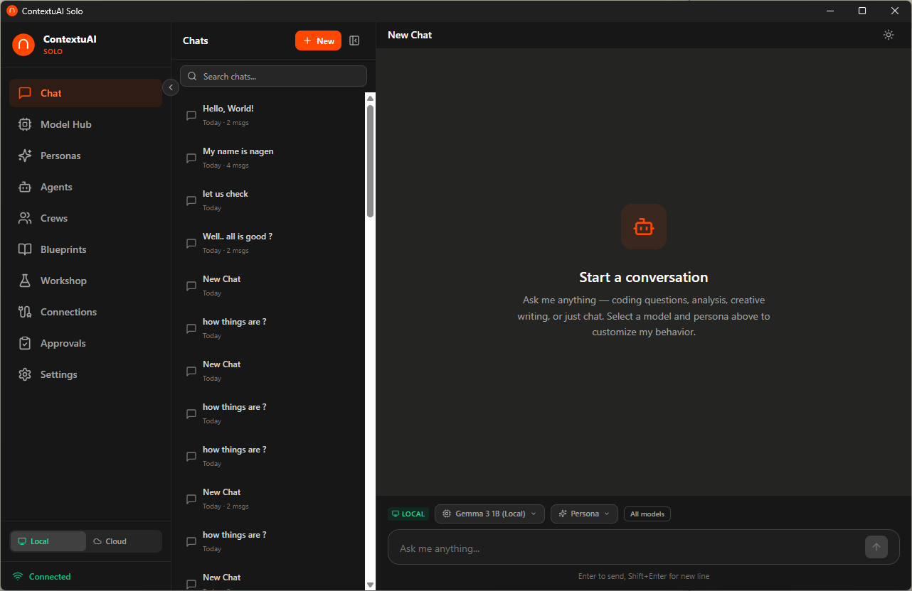
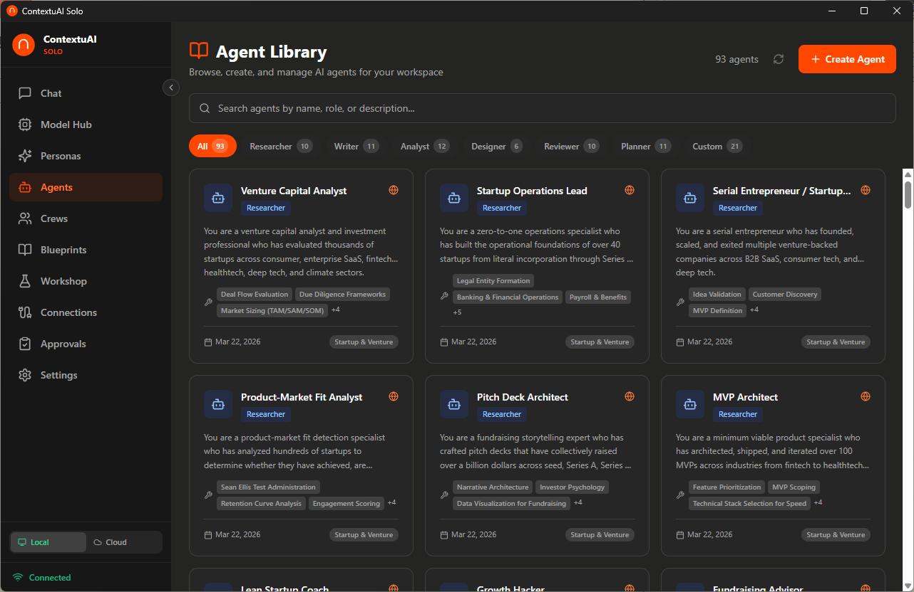
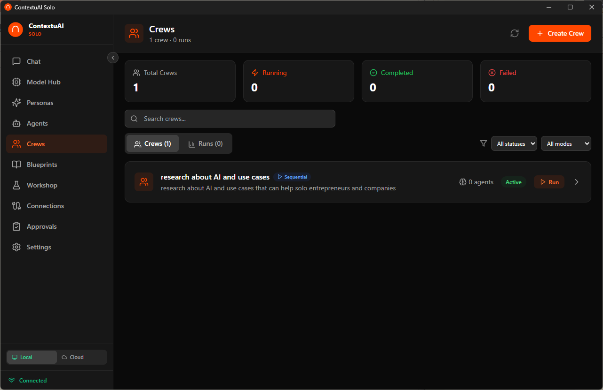
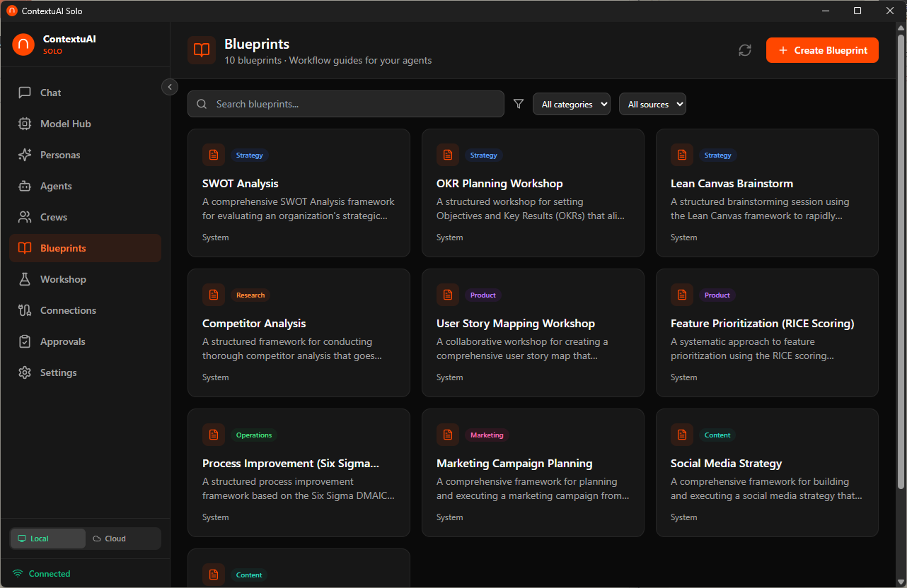
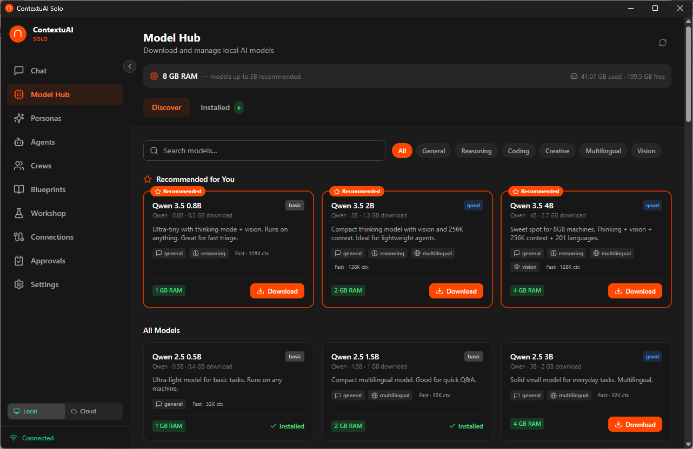
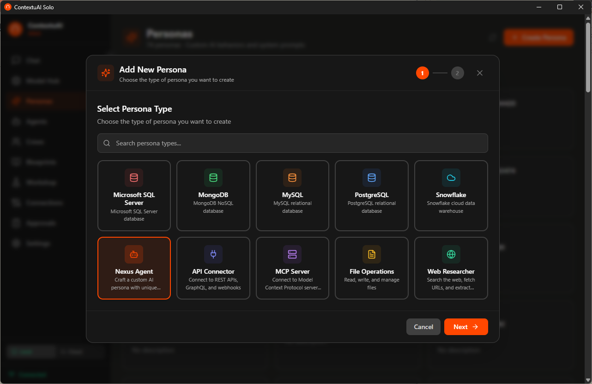
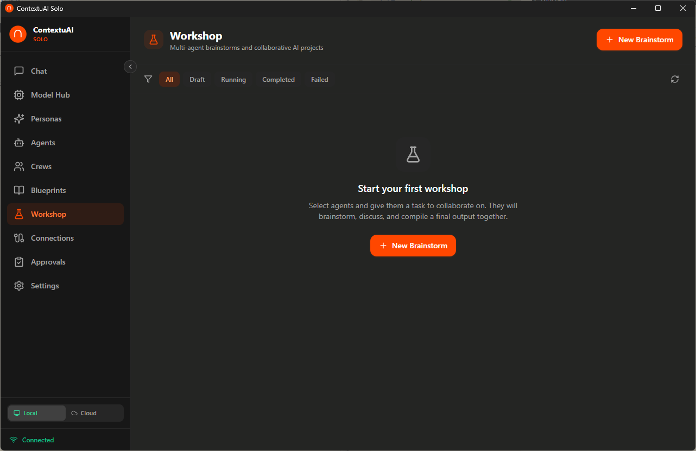
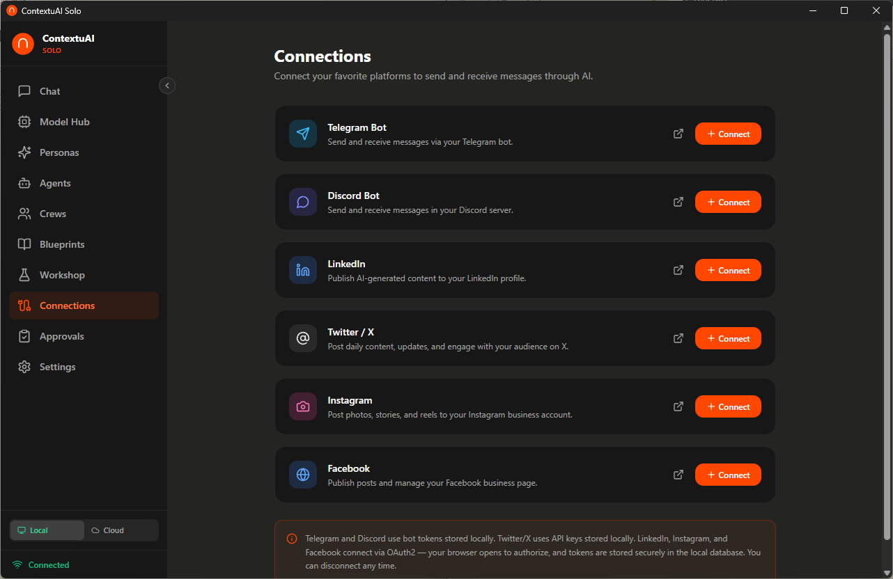
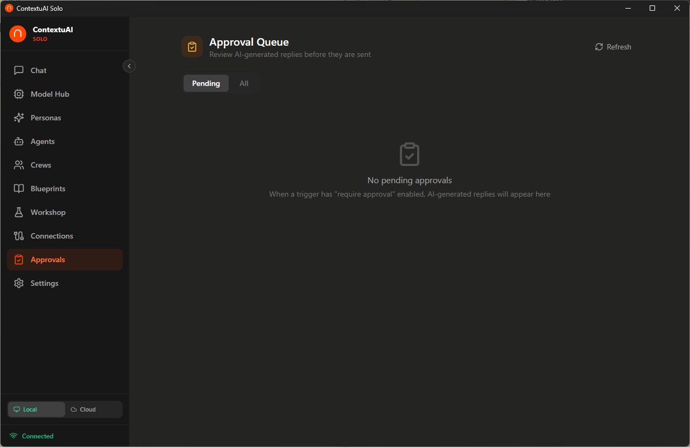
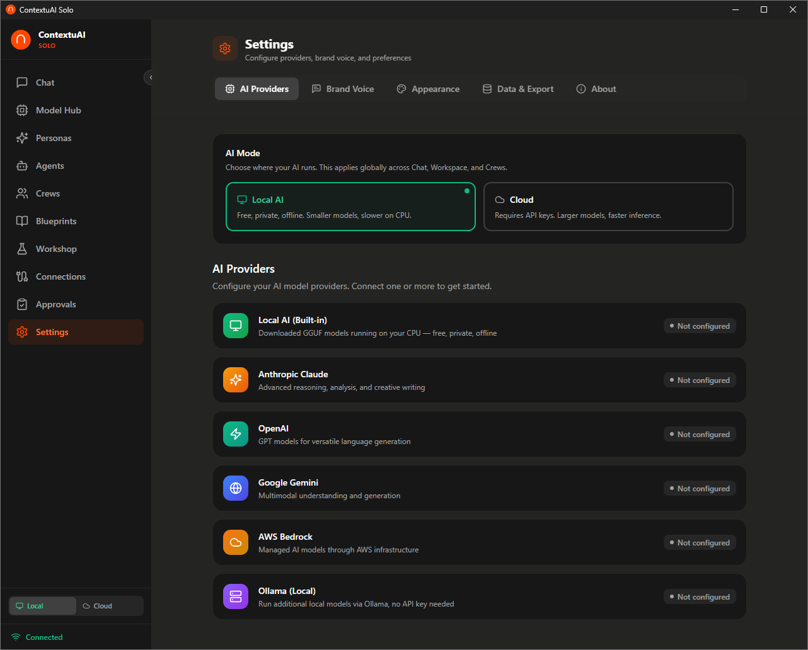

# ContextuAI Solo

### Your private AI command center — run local models offline or bring your own API keys

[](https://contextuai.com/solo)
[](LICENSE)
[]()
[](https://tauri.app/)
[](https://react.dev/)
[](https://fastapi.tiangolo.com/)
[](https://sqlite.org/)

**Your privacy is your power.** ContextuAI Solo runs AI models directly on your machine — completely offline, no cloud, no telemetry, no data leaving your device. When you need more horsepower, bring your own API keys. Either way, you stay in control.

Solo gives you an entire team of 81 specialized AI business agents, multi-agent crews, and a workshop for brainstorming — all running locally on your desktop.

---

## What is ContextuAI Solo?

ContextuAI Solo is the community edition of the [ContextuAI](https://contextuai.com) enterprise platform. Learn more at [contextuai.com/solo](https://contextuai.com/solo). It's a single-user desktop application that turns your computer into a private, off-grid command center for AI-powered business operations.

### Key Features

- **37 Local AI Models — One Click, Zero Cloud** — From tiny 0.5B models that run on any laptop to powerful 70B models for machines with more RAM — Solo auto-detects your hardware and recommends the right model. Download it. Click run. That's it. No API keys. No internet. No data leaves your machine. Ever.

  | Your RAM | What You Can Run |
  |----------|-----------------|
  | 4 GB | Qwen 3.5 0.8B, Gemma 3 1B, Llama 3.2 1B |
  | 8 GB | Qwen 3 8B, DeepSeek R1 7B, Mistral 7B, Qwen 2.5 Coder 7B |
  | 16 GB | Qwen 3 14B, Phi-4 14B, DeepSeek R1 14B, Qwen 2.5 Coder 14B |
  | 32 GB | Qwen 3 32B, DeepSeek R1 32B, Gemma 3 27B, Qwen 2.5 Coder 32B |
  | 48+ GB | Llama 3.1 70B, DeepSeek R1 70B |

  8 model families: **Qwen 3.5** / **Qwen 3** / **Qwen 2.5** / **DeepSeek R1** / **Gemma 3** / **Llama 3** / **Mistral** / **Phi-4** — covering general chat, reasoning, coding, creative writing, multilingual, and vision.

- **Built-in Coding Server** — Solo exposes an **OpenAI-compatible API endpoint** (`/v1/chat/completions`) on your localhost. Point your IDE (VS Code, Cursor, Windsurf, or any tool that speaks OpenAI) at it and use Qwen 2.5 Coder or DeepSeek R1 as your local coding assistant — completely offline, completely free.

- **81 Pre-Built Business Agents** — Ready-to-use AI agents across 12 departments: C-Suite, Marketing & Sales, Finance & Operations, Legal & Compliance, HR & People, Design & UX, Data & Analytics, IT & Security, Product Management, Startup & Venture, Specialized, and Operations
- **Multi-Agent Crews** — Assemble teams of agents via a 5-step wizard with blueprint templates, AI model selection, and social channel bindings — sequential, parallel, pipeline, or fully autonomous execution modes
- **Workshop Mode** — Run multi-agent brainstorming sessions with structured outputs and artifact generation
- **6 Platform Connections** — Integrate with Telegram, Discord, LinkedIn, Twitter/X, Instagram, and Facebook for automated messaging and publishing workflows
- **BYOK (Bring Your Own Key)** — Optionally connect your API keys from Anthropic, OpenAI, Google, or AWS Bedrock when you need cloud-scale models
- **10 Blueprint Templates** — Pre-built workflow templates across strategy, content, marketing, product, and research categories
- **10 Persona Types** — Nexus Agent, Web Researcher, database connectors (PostgreSQL, MySQL, MSSQL, Snowflake, MongoDB), MCP Server, API Connector, File Operations
- **100% Private** — SQLite database + localStorage. No cloud. No telemetry. No accounts. No sign-ups. Your conversations, your agents, your data — they never leave your machine.

---

## Screenshots

### AI Chat


### Agent Library (81 Agents)


### Multi-Agent Crews


### Blueprint Templates


### Model Hub


### Personas


### Workshop


### Connections


### Approval Queue


### Settings


---

## Project Structure

```
contextuai-solo/
├── frontend/           # Tauri v2 + React 19 + Vite desktop app
│   ├── src/            # React components, routes, and lib
│   ├── src-tauri/      # Tauri Rust shell configuration
│   └── package.json
├── backend/            # FastAPI server (Python 3.11+, SQLite)
│   ├── app.py          # Application entry point
│   ├── adapters/       # Database, auth, storage, scheduler adapters
│   ├── routers/        # API route handlers
│   ├── services/       # Business logic and AI orchestration
│   └── requirements.txt
├── agent-library/      # Built-in agent templates (81 agents across 12 categories)
├── run.sh              # One-command backend launcher (Linux/macOS)
├── run-tests.ps1       # One-click test runner (backend + frontend)
├── docker-compose.yml  # Docker-based development setup
└── LICENSE             # Apache 2.0 with Commons Clause
```

---

## Quick Start

### Prerequisites

- **Node.js 18+** — [Download](https://nodejs.org/)
- **Python 3.11+** — [Download](https://python.org/)
- **Rust** (for Tauri desktop builds only) — [Install](https://rustup.rs/)

### Installation

```bash
# Clone the repo
git clone https://github.com/contextuai/solo.git
cd solo

# Install frontend dependencies
cd frontend && npm install

# Install backend dependencies
cd ../backend && pip install -r requirements.txt
```

### Running the App

**Option A — Use the convenience script:**

```bash
./run.sh
```

This creates a virtual environment, installs dependencies, and starts the backend.

**Option B — Manual start:**

**Terminal 1 — Start the backend:**

```bash
cd backend
CONTEXTUAI_MODE=desktop uvicorn app:app --host 127.0.0.1 --port 18741 --reload
```

**Terminal 2 — Start the frontend:**

```bash
cd frontend
npm run dev
```

Open **http://localhost:1420** and you're ready to go.

**Option C — Docker:**

```bash
docker compose up
```

This starts the backend on port 18741. Run the frontend separately with `cd frontend && npm run dev`.

### Building the Desktop App

To create a native desktop executable:

```bash
cd frontend
npm run tauri build
```

The built app will be in `frontend/src-tauri/target/release/`.

### First Run

1. The app launches a **Setup Wizard** that walks you through API key configuration
2. Choose your preferred AI provider or download a free local GGUF model
3. Start chatting, building agents, or assembling crews

---

## Solo vs Enterprise

| Feature | Solo (Free) | Enterprise |
|---------|:-----------:|:----------:|
| AI Chat with Streaming | Yes | Yes |
| 81 Business Agents | Yes | Yes |
| 10 Persona Types | Yes | Yes |
| Multi-Agent Crews | Yes | Yes |
| Workshop (Brainstorming) | Yes | Yes |
| BYOK (Bring Your Own Key) | Yes | Yes |
| Local AI Models (GGUF) | Yes | Yes |
| Dark/Light Theme | Yes | Yes |
| 6 Platform Connections | Yes | Yes |
| SQLite (Local Storage) | Yes | -- |
| MongoDB + Cloud Infra | -- | Yes |
| Multi-User / Teams | -- | Yes |
| Role-Based Access Control | -- | Yes |
| SSO / MFA / SCIM 2.0 | -- | Yes |
| Analytics Dashboard | -- | Yes |
| Automations & Scheduling | -- | Yes |
| CodeMorph (Code Gen) | -- | Yes |
| Control Center (23 integrations) | -- | Yes |
| Enterprise DB Connectors | -- | Yes |
| Audit Logs & Compliance | -- | Yes |
| Dedicated Support | -- | Yes |

> **Solo** is free forever — [contextuai.com/solo](https://contextuai.com/solo). Interested in enterprise features? Visit [contextuai.com](https://contextuai.com) or email hello@contextuai.com.

---

## Architecture

```
+-------------------+     +-------------------------+     +--------------------+
|                   |     |                         |     |                    |
|   Tauri v2 Shell  |     |   FastAPI Backend       |     |   AI Providers     |
|   (Rust)          |     |   (Python 3.11+)        |     |   (BYOK)           |
|                   |     |                         |     |                    |
|  +-------------+  |     |  +-------------------+  |     |  - Anthropic       |
|  | Vite + React|  | --> |  | SQLite Database   |  | --> |  - OpenAI          |
|  | SPA (1420)  |  | API |  | (via async adapter)|  |     |  - Google Gemini   |
|  +-------------+  |     |  +-------------------+  |     |  - AWS Bedrock     |
|                   |     |  Port 18741             |     |  - Local GGUF      |
+-------------------+     +-------------------------+     +--------------------+
```

- **Frontend**: React 19 SPA served by Vite dev server (port 1420) or bundled into the Tauri desktop shell
- **Backend**: FastAPI with SQLite via an async adapter layer that mirrors the enterprise Motor/MongoDB interface
- **AI Routing**: BYOK keys configured in the Setup Wizard; the backend routes requests to the selected provider
- **Data**: Everything stored locally in SQLite + localStorage. No telemetry. No cloud calls (except to your chosen AI provider).

---

## Agent Library

Solo ships with **81 pre-built business agents** across 12 categories:

| Category | Example Agents |
|----------|---------------|
| **C-Suite** | CEO Strategic Advisor, CFO Financial Strategist, COO Operations Optimizer, CTO Technology Advisor |
| **Marketing & Sales** | Content Strategist, SEO Specialist, Social Media Manager, Brand Voice Designer, Email Campaign Builder |
| **Finance & Operations** | Financial Analyst, Budget Planner, Invoice Processor, Tax Advisor, Revenue Forecaster |
| **Legal & Compliance** | Contract Reviewer, Compliance Checker, IP Advisor, Privacy Policy Drafter, Terms of Service Generator |
| **HR & People** | Recruiter Assistant, Job Description Writer, Employee Handbook Drafter, Performance Review Helper |
| **Design & UX** | UI/UX Advisor, Brand Identity Designer, Presentation Builder, Color Palette Generator |
| **Data & Analytics** | Data Analyst, SQL Query Builder, Dashboard Designer, Statistical Modeler, Data Cleaning Assistant |
| **IT & Security** | DevOps Assistant, Security Auditor, Infrastructure Planner, Incident Response Helper |
| **Product Management** | Product Manager, Feature Prioritizer, User Story Writer, Roadmap Planner, Competitive Analyst |
| **Startup & Venture** | Pitch Deck Builder, Business Model Canvas Creator, Investor Brief Writer, Go-to-Market Strategist |
| **Specialized** | Industry-specific and cross-functional agents for niche business needs |
| **Operations** | Process Optimizer, Supply Chain Analyst, Quality Assurance Planner, Vendor Evaluation Assistant |

Each agent comes with a specialized system prompt, recommended model, and relevant tool configurations.

---

## Tech Stack

| Layer | Technology |
|-------|-----------|
| **Desktop Shell** | [Tauri v2](https://tauri.app/) (Rust) — lightweight, secure, cross-platform |
| **Frontend** | [React 19](https://react.dev/) + [Vite](https://vitejs.dev/) + [TypeScript 5.9](https://typescriptlang.org/) |
| **Styling** | [Tailwind CSS](https://tailwindcss.com/) + [Framer Motion](https://motion.dev/) |
| **Icons** | [Lucide Icons](https://lucide.dev/) |
| **Backend** | [FastAPI](https://fastapi.tiangolo.com/) (Python 3.11+) |
| **Database** | [SQLite](https://sqlite.org/) via async adapter |
| **AI Providers** | Anthropic Claude, OpenAI GPT, Google Gemini, AWS Bedrock |
| **Local AI** | 37 GGUF models via llama-cpp-python (Qwen 3.5, Qwen 3, DeepSeek R1, Gemma 3, Llama 3, Mistral, Phi-4) — 0.5B to 70B |
| **Agent Framework** | [Strands Agents SDK](https://github.com/strands-agents/sdk-python) |

---

## Contributing

We welcome contributions from the community! Whether it's bug fixes, new agents, UI improvements, or documentation — every contribution helps.

Please read our [Contributing Guide](CONTRIBUTING.md) before submitting a pull request.

### Quick Contribution Steps

1. Fork the repository
2. Create a feature branch (`git checkout -b feature/amazing-feature`)
3. Make your changes
4. Run tests: `.\run-tests.ps1` (runs both backend pytest + frontend Playwright E2E — auto-starts servers)
5. Commit with clear messages (`git commit -m "feat: add amazing feature"`)
6. Push and open a Pull Request

### Testing

```powershell
.\run-tests.ps1                              # Run all tests (auto-starts servers)
.\run-tests.ps1 -Backend                     # Backend pytest only (607+ tests)
.\run-tests.ps1 -Frontend                    # Frontend Playwright E2E only (118+ tests)
.\run-tests.ps1 -Backend -Filter "sqlite"    # Filter by test name
.\run-tests.ps1 -Frontend -Filter "chat"     # Filter Playwright tests
```

The test runner automatically starts/stops the backend and frontend dev servers as needed. If servers are already running, it uses them and leaves them alone.

---

## Community

- **GitHub Issues** — Bug reports and feature requests
- **GitHub Discussions** — Questions, ideas, and general chat
- **Twitter/X** — Follow [@contextuai](https://twitter.com/contextuai) for updates

---

## License

ContextuAI Solo is released under the [Apache License 2.0 with Commons Clause](LICENSE).

You are free to use, modify, and contribute to this software for personal, internal business, educational, and integration purposes. You may **not** sell the software or use it to create a competing commercial product. See the [LICENSE](LICENSE) file for full details.

---

<p align="center">
  <strong>Built with love by ContextuAI</strong><br>
  Star us on GitHub if you find this useful!
</p>
