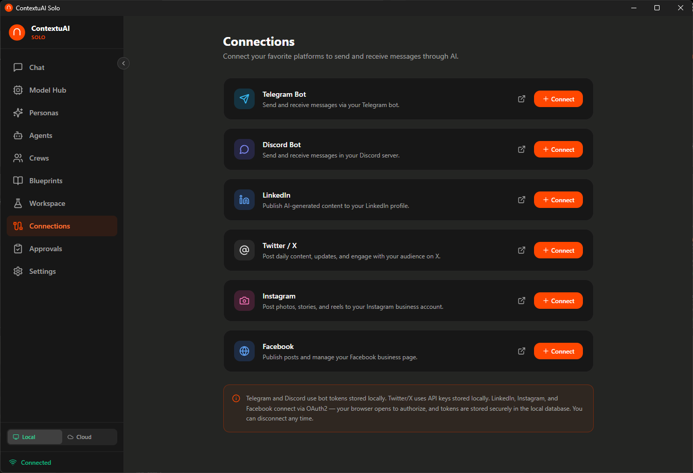

# Connections

Connections let you integrate ContextuAI Solo with external platforms. Connect to social channels so your Crews can send and receive messages on your behalf.

---

## Getting Started

1. Navigate to **Connections** from the sidebar.
2. Expand a platform card to set up the integration.
3. Enter your credentials and save.
4. Use the connection in Crew Builder (Step 4) to bind crews to channels.

## Supported Platforms

| Platform | Auth Method | Direction |
|----------|------------|-----------|
| **Telegram** | Bot Token | Inbound + Outbound |
| **Discord** | Bot Token + App ID | Inbound + Outbound |
| **Twitter/X** | API Key + Secret + Tokens | Outbound only |
| **LinkedIn** | OAuth (Client ID + Secret) | Outbound only |
| **Instagram** | OAuth (App ID + Secret) | Outbound only |
| **Facebook** | OAuth (App ID + Secret) | Outbound only |

## Token-Paste Connections

### Telegram

1. Create a bot via [@BotFather](https://t.me/BotFather) on Telegram.
2. Copy the **Bot Token**.
3. Paste it into the Telegram card and click **Save**.

### Discord

1. Create an application at the [Discord Developer Portal](https://discord.com/developers/applications).
2. Copy the **Bot Token**, **Public Key**, and **Application ID**.
3. Paste all three into the Discord card and click **Save**.

### Twitter/X

1. Create a project at the [Twitter Developer Portal](https://developer.twitter.com).
2. Copy the **API Key**, **API Secret**, **Access Token**, and **Access Token Secret**.
3. Paste all four into the Twitter/X card and click **Save**.

## OAuth Connections

### LinkedIn

1. Create an app at the [LinkedIn Developer Portal](https://www.linkedin.com/developers/).
2. Enter the **Client ID** and **Client Secret** in the LinkedIn card.
3. Add the callback URL shown in the card to your LinkedIn app settings.
4. Click **Sign in with LinkedIn** to complete the OAuth flow.

### Instagram

1. Create an app at [Meta for Developers](https://developers.facebook.com/).
2. Enter the **App ID** and **App Secret** in the Instagram card.
3. Add the callback URL to your app settings.
4. Click **Sign in with Instagram** to complete the OAuth flow.

### Facebook

1. Create an app at [Meta for Developers](https://developers.facebook.com/).
2. Enter the **App ID** and **App Secret** in the Facebook card.
3. Add the callback URL to your app settings.
4. Click **Sign in with Facebook** to complete the OAuth flow.

## Connection Status

Each platform card shows:

- **Connected** (green badge) — credentials are saved and valid
- **Disconnected** (gray badge) — no credentials saved
- **Profile name** — displayed when connected (where applicable)

## Direction Toggles

For platforms that support it, you can toggle:

- **Inbound** — the crew receives messages from the platform
- **Outbound** — the crew sends messages to the platform

Telegram and Discord support both directions. LinkedIn, Twitter/X, Instagram, and Facebook are outbound only.

## Managing Connections

- **Edit** — click the edit button on a connected platform to update credentials
- **Disconnect** — click to clear saved credentials and disconnect
- **Cancel** — discard changes without saving

## Using Connections in Crews

After setting up a connection:

1. Create or edit a crew.
2. In **Step 4 (Connections)**, you'll see your connected platforms.
3. Select which channels this crew should use.
4. Optionally enable **"Require approval"** for each channel — the crew will pause and ask you before posting.

## Tips

- **Set up connections before creating crews** — the Crew Builder only shows platforms that are already configured.
- **Always enable approval** for social channels when first testing — review what the AI wants to post before it goes live.
- **Telegram is the easiest to start with** — creating a bot takes less than a minute via BotFather.
- **Keep your API keys secure** — credentials are stored locally on your machine, but treat them like passwords.
- **Disconnect platforms you're not using** to keep your Connections page clean.
