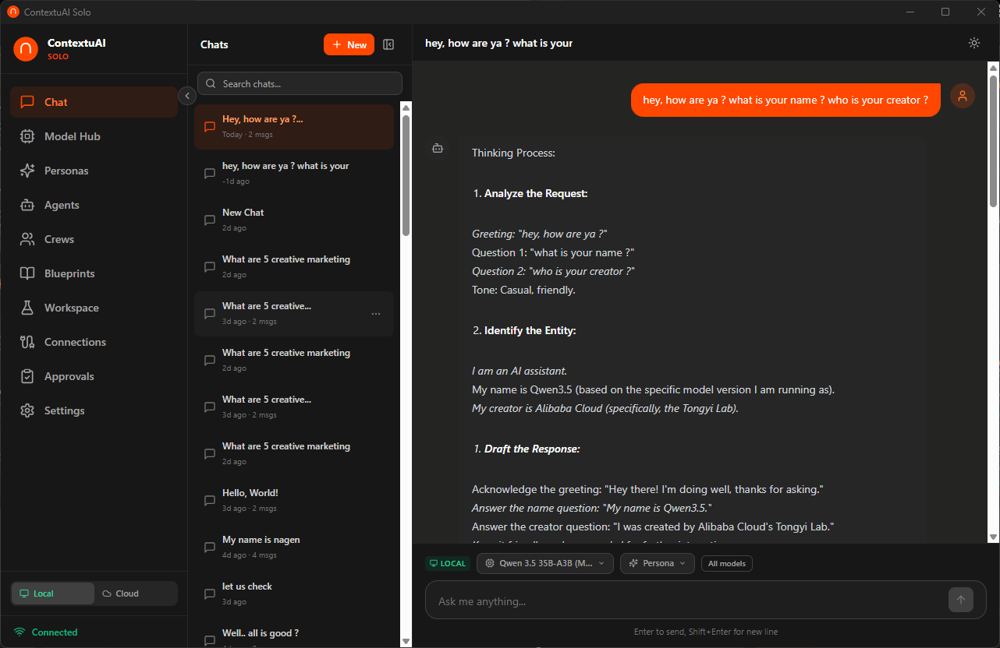
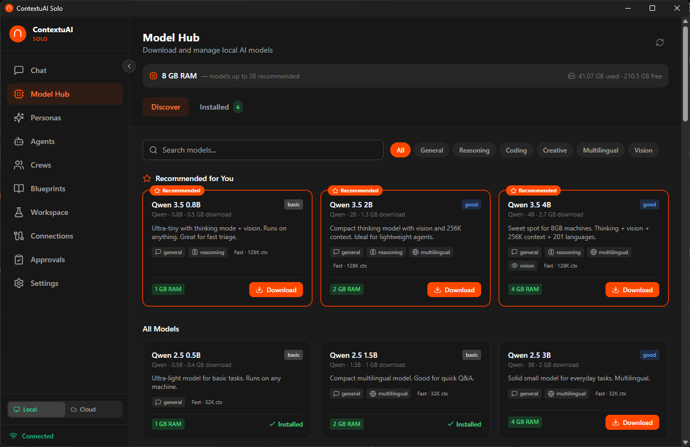
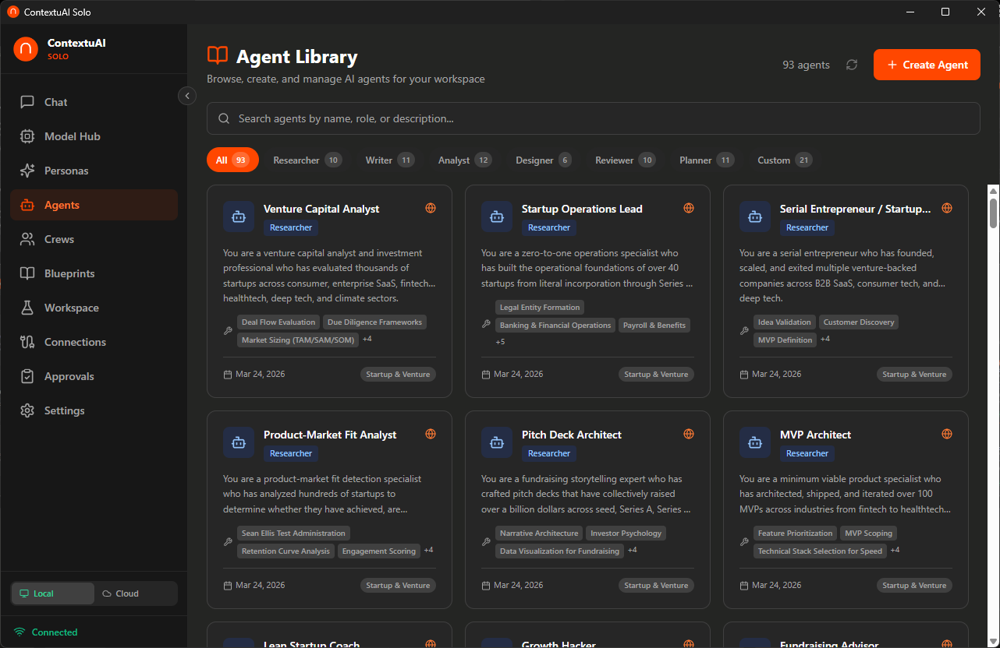
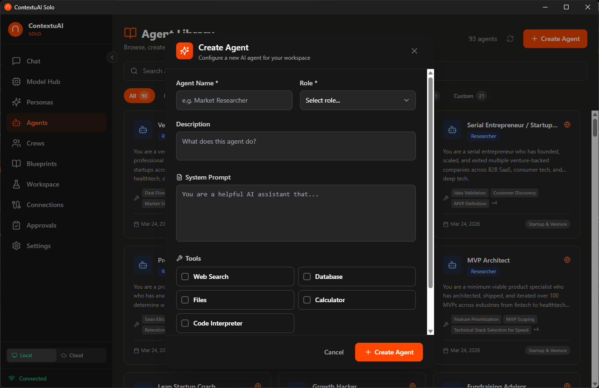
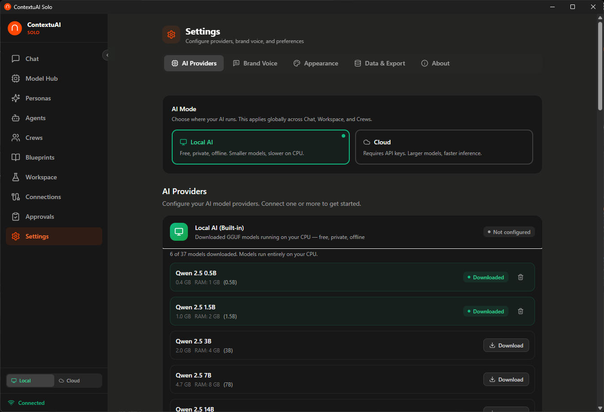

# ContextuAI Solo — User Guide

Welcome to ContextuAI Solo, your private desktop AI assistant with 81 pre-built business agents. This guide covers every module in the app to help you get started quickly.

## Modules

| # | Module | What it does |
|---|--------|-------------|
| 1 | [Chat](01-chat.md) | Have conversations with AI models, manage sessions, pick personas |
| 2 | [Model Hub](02-model-hub.md) | Configure cloud AI providers and download local models |
| 3 | [Personas](03-personas.md) | Create specialized AI personalities with custom instructions |
| 4 | [Agents](04-agents.md) | Browse 81 business agents and create your own |
| 5 | [Crews](05-crews.md) | Build multi-agent teams that work together on tasks |
| 6 | [Blueprints](06-blueprints.md) | Use workflow templates to jumpstart projects |
| 7 | [Workspace](07-workspace.md) | Run multi-agent projects and review results |
| 8 | [Connections](08-connections.md) | Connect to Telegram, Discord, LinkedIn, Twitter/X, Instagram, Facebook |
| 9 | [Settings](09-settings.md) | API keys, brand voice, appearance, data export |

## Quick Start

1. **Open the app** — No login required. You're the admin.
2. **Add an AI provider** — Go to **Settings > AI Providers** and enter an API key (Anthropic, OpenAI, or Google), or download a free local model.
3. **Start chatting** — Head to **Chat**, pick a model, and send your first message.
4. **Explore agents** — Browse the **Agent Library** to find pre-built specialists for your business needs.
5. **Build a crew** — Combine agents into a **Crew** to tackle complex, multi-step tasks.

## Where is my data stored?

All data stays on your machine. Nothing is sent to ContextuAI servers.

- **Database:** `~/.contextuai-solo/data/contextuai.db` (SQLite)
- **Local models:** `~/.contextuai-solo/models/` (GGUF files)
- **Exports:** Downloaded to your default Downloads folder

## Screenshots

Screenshots referenced in these guides are located in [`docs/screenshots/`](../screenshots/).

| Screenshot | Module |
|-----------|--------|
|  | Chat |
|  | Model Hub |
|  | Model Hub |
|  | Personas |
|  | Personas |
|  | Agents |
|  | Agents |
|  | Crews |
|  | Blueprints |
|  | Blueprints |
|  | Workspace |
|  | Connections |
|  | Crews |
|  | Settings |
