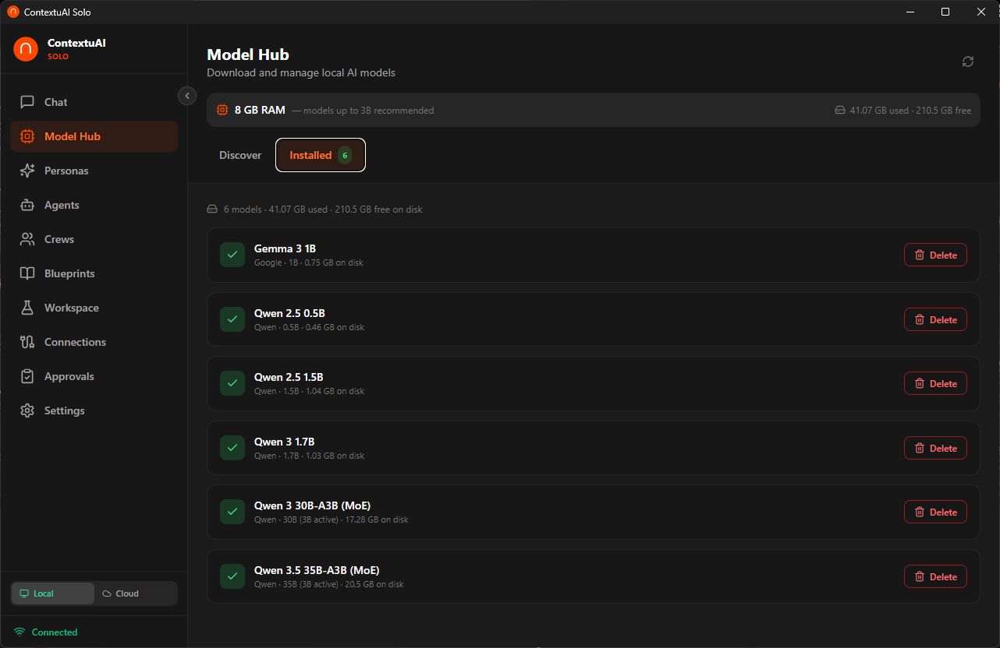

# Video 2: Model Hub Deep Dive

> **Director's Context:** ContextuAI Solo is a desktop AI app that runs entirely locally. This video focuses on the Model Hub — the built-in marketplace of 35+ AI models users can download and run on their laptop without a GPU. This is the key differentiator: real AI models running privately on your own hardware. The target audience is non-technical business professionals who want to understand which model to pick.

**Duration:** 3 minutes
**Goal:** Help users understand local vs cloud models, browse the Model Hub, and pick the right model for their hardware.

---

## Opening (0:00 - 0:15)

**On screen:** Solo logo, then transition to Model Hub page

**Voiceover:**
> "Solo ships with a Model Hub of 35+ AI models — from tiny 1B models that run on any machine to powerful 32B models for serious analysis. Let's find the right model for you."

---

## Scene 1: Understanding Model Tiers (0:15 - 0:45)

**On screen:** Model Hub with tier badges highlighted — Basic, Good, Great, Best

**Voiceover:**
> "Every model in the Hub has a quality tier. Basic models like Qwen 2.5 0.5B are ultra-fast but limited. Good models like Llama 3.1 8B handle most business tasks well. Great models like DeepSeek R1 14B and Phi-4 14B deliver near-cloud quality. And Best tier — Qwen 3.5 27B or Mistral Small 22B — that's as good as it gets locally."

**Key point for NotebookLM:** Emphasize that quality tiers map to RAM requirements. Users should look at the RAM badge next to each model — if it says 8GB and their laptop has 16GB, they're good.

---

## Scene 2: Recommended Models by Laptop (0:45 - 1:30)

**On screen:** Highlight these models one by one with RAM indicators

**Voiceover:**
> "Here's the cheat sheet. Got 8GB RAM? Download Qwen 3.5 9B — it's the latest and punches way above its weight. 16GB RAM? Go for DeepSeek R1 14B — it's a reasoning powerhouse, or Phi-4 14B from Microsoft. 32GB RAM? Qwen 3.5 27B or Mistral Small 22B will feel like using a cloud API. And if you just want to test things out, Llama 3.2 3B downloads in under a minute."

**Key point for NotebookLM:** This is the most important part of the video. Users need a clear, simple recommendation. Don't overwhelm with all 35 models — lead with the best picks per hardware tier.

---

## Scene 3: One-Click Download (1:30 - 2:00)

**On screen:** Click Download on a model → progress bar → Installed badge

**Voiceover:**
> "Downloading is one click. Hit the download button, and Solo pulls the model from HuggingFace. You'll see a progress bar with percentage and file size. Once it's done, the model gets an 'Installed' badge and it's ready to use in Chat, Crews, and Workspace."

---

## Scene 4: Cloud Providers (2:00 - 2:30)

**On screen:** Settings → Add API Key for Anthropic Claude

**Voiceover:**
> "Local models are great for privacy, but sometimes you need more power. Solo also supports Anthropic Claude and AWS Bedrock. Just add your API key in Settings, and cloud models appear alongside local ones in every model dropdown. You can mix and match — use local for sensitive client work, cloud for heavy analysis."

---

## Scene 5: Custom GGUF Models (2:30 - 2:50)

**On screen:** File explorer showing a .gguf file being dropped into the models folder

**Voiceover:**
> "Power users — you can drop any GGUF model file into your models folder at home directory, dot contextuai-solo, models. Solo auto-detects it on next launch and registers it in the Hub. So if your favorite model isn't in the catalog, just bring your own."

---

## Closing (2:50 - 3:00)

**Voiceover:**
> "That's the Model Hub — 35+ models, one-click download, no GPU needed. Pick the right one for your hardware and you're ready to go. Next up: Chat Like a Pro."

**End card:** "Next: Chat Like a Pro" + Subscribe/Follow CTA
