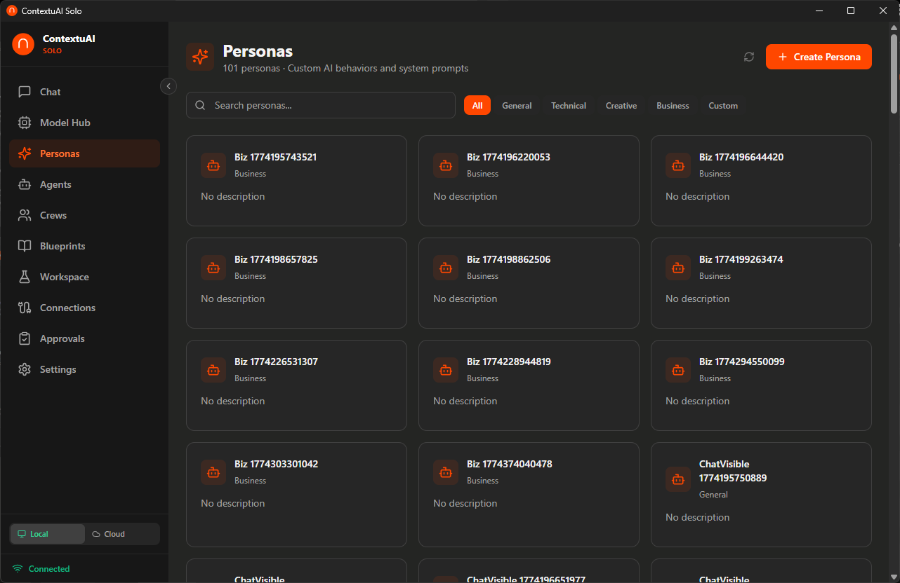
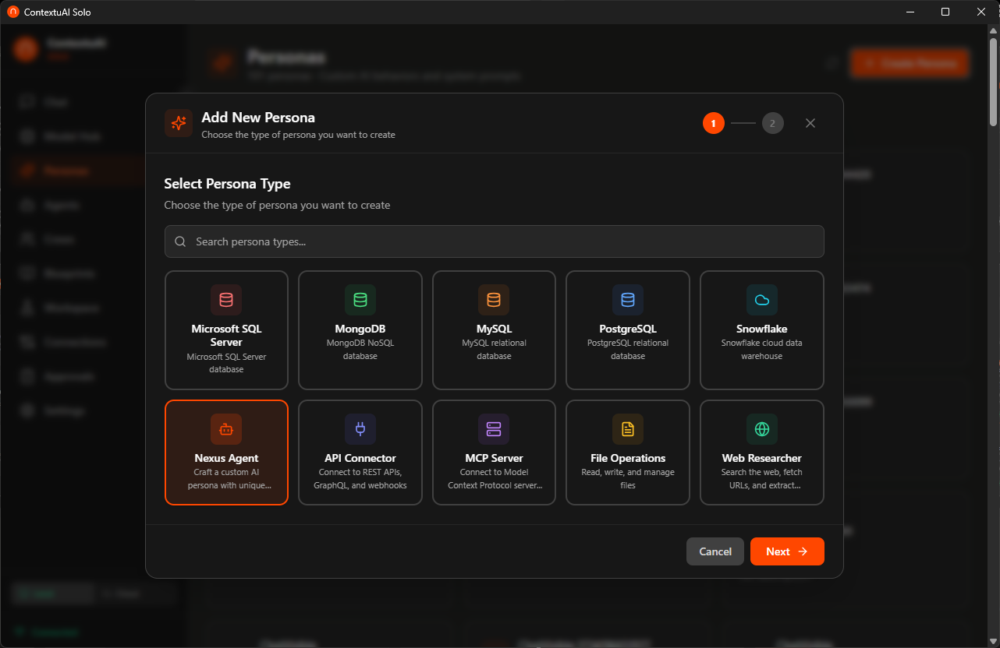

# Video 5: Personas — Your AI Personalities

> **Director's Context:** Personas in ContextuAI Solo customize how the AI behaves in Chat. They are NOT the same as Agents (which work in Crews/Workspace). Personas are for direct chat interaction. Solo ships with 10 persona types including Nexus Agent (general-purpose), database connectors (PostgreSQL, MySQL, MSSQL, Snowflake, MongoDB), MCP Server, API Connector, and File Operations. Important: social platforms like Slack and Twitter are NOT personas — those belong in Connections.

**Duration:** 2 minutes
**Goal:** Show persona types, how to create one, and how they change chat behavior.

---

## Opening (0:00 - 0:10)

**On screen:** Personas page showing the persona gallery with type cards

**Voiceover:**
> "Personas change how Solo talks to you. Think of them as AI personalities — each tuned for a specific job."

---

## Scene 1: Persona Types (0:10 - 0:40)

**On screen:** Scroll through the 10 persona type cards with icons

**Voiceover:**
> "Solo has 10 persona types. Nexus Agent is your general-purpose personality — customize it with any system prompt for any use case. Then there are five database connectors — PostgreSQL, MySQL, MSSQL, Snowflake, and MongoDB. These let you chat with your databases in plain English. And three integration types — MCP Server, API Connector, and File Operations — for connecting to external tools and working with files."

**Key point for NotebookLM:** Be very clear that personas are for Chat only. Agents are for Crews and Workspace. This is the most common confusion for new users.

---

## Scene 2: Creating a Persona (0:40 - 1:15)

**On screen:** 2-step wizard — Step 1: select type card, Step 2: configure details

**Voiceover:**
> "Creating a persona is a 2-step wizard. Step 1 — pick a type from the card grid. You can search to find what you need. Step 2 — configure the details. For a Nexus Agent, that's a name and system prompt. For a database persona, you'll add connection credentials — host, port, database name, username, password. Everything stays local on your machine."

---

## Scene 3: Database Personas in Action (1:15 - 1:45)

**On screen:** Chat with a PostgreSQL persona — user asks "What were our top 5 products by revenue last quarter?" → AI generates and runs SQL

**Voiceover:**
> "Here's where personas get powerful. With a database persona active, you can ask business questions in plain English. 'What were our top 5 products by revenue last quarter?' Solo translates that to SQL, runs it against your database, and gives you the answer. No SQL knowledge needed. And your data never touches the cloud."

**Key point for NotebookLM:** This is a strong demo moment. Business users querying their own databases with natural language — privately, on their desktop. Emphasize the privacy angle for sensitive financial/customer data.

---

## Closing (1:45 - 2:00)

**Voiceover:**
> "Personas make Solo personal — from general AI chat to querying your company's databases in plain English. Next up: Blueprints."

**End card:** "Next: Blueprints — Workflow Templates" + Subscribe/Follow CTA
