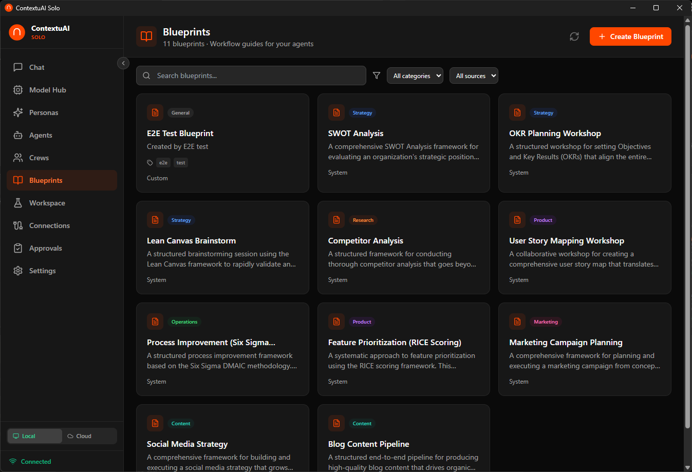
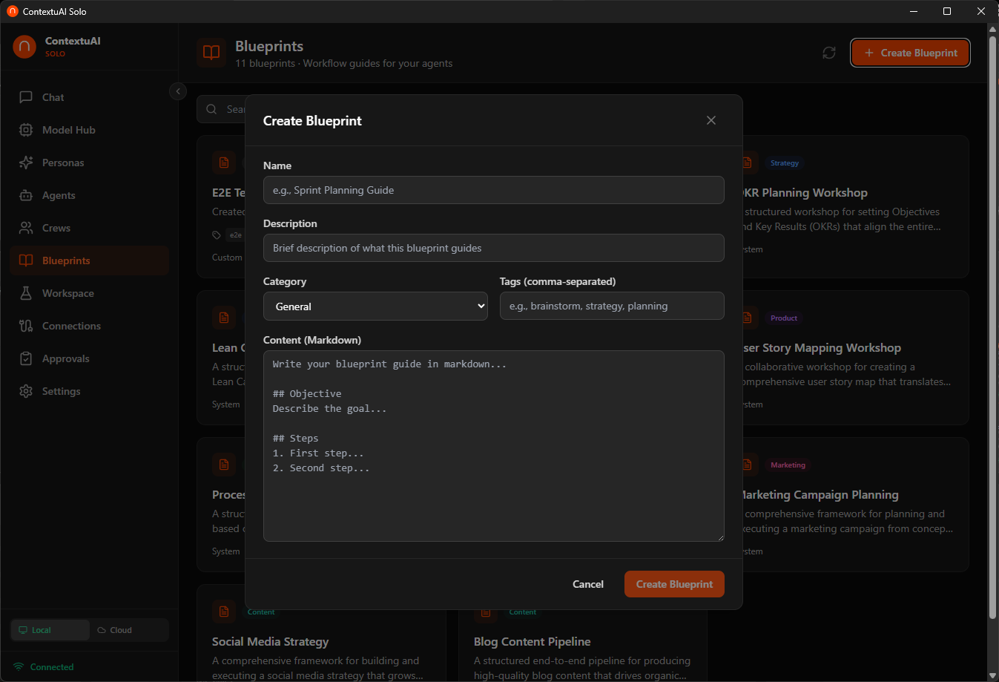

# Video 6: Blueprints — Workflow Templates

> **Director's Context:** Blueprints are pre-built workflow templates in ContextuAI Solo. They provide a structured step-by-step plan that Crews and Workspace projects can follow. Solo ships with 10 blueprints across 5 categories (strategy, content, marketing, product, research). Users can also create custom blueprints. Think of blueprints as playbooks — they tell agents what to do and in what order.

**Duration:** 2 minutes
**Goal:** Show how blueprints provide ready-made workflows and how to use or create them.

---

## Opening (0:00 - 0:10)

**On screen:** Blueprint Library page with category filters

**Voiceover:**
> "Blueprints are workflow recipes — step-by-step playbooks your AI agents follow. Solo ships with 10 ready to use."

---

## Scene 1: Browsing Blueprints (0:10 - 0:40)

**On screen:** Click through categories — Strategy, Content, Marketing, Product, Research

**Voiceover:**
> "10 blueprints across 5 categories. Strategy has competitive analysis and market research workflows. Content covers blog posts, social media calendars, and repurposing. Marketing has campaign planning and launch templates. Product includes feature specs and user feedback analysis. Research has deep-dive investigation workflows. Each one is a proven structure you'd normally build from scratch."

**Key point for NotebookLM:** Emphasize that blueprints save hours of planning. A Content Calendar blueprint gives you the exact workflow a social media manager would follow — research, draft, review, publish — all as structured steps.

---

## Scene 2: Using a Blueprint (0:40 - 1:15)

**On screen:** Select a blueprint → show it pre-filling a Crew or Workspace project

**Voiceover:**
> "Using a blueprint is simple. When you create a Crew or Workspace project, you'll see a 'Select Blueprint' option. Pick one, and it pre-fills the workflow steps and suggests which agents to include. You can customize everything — add steps, remove steps, swap agents. The blueprint is a starting point, not a straitjacket."

---

## Scene 3: Creating Custom Blueprints (1:15 - 1:50)

**On screen:** Click "Create Blueprint" → fill in name, category, markdown workflow steps

**Voiceover:**
> "Got a workflow that works for your business? Turn it into a blueprint. Click 'Create Blueprint', give it a name and category, then write your workflow steps in Markdown. Step 1: Research the market. Step 2: Draft the analysis. Step 3: Review and refine. Now your entire team — AI agents and all — follows the same playbook every time."

**Key point for NotebookLM:** Custom blueprints are about repeatability. A consultant who runs the same analysis for every new client can blueprint it once and reuse forever.

---

## Closing (1:50 - 2:00)

**Voiceover:**
> "Blueprints turn complex workflows into repeatable playbooks. Next up: the big one — Crews."

**End card:** "Next: Crews — Multi-Agent Teams" + Subscribe/Follow CTA
