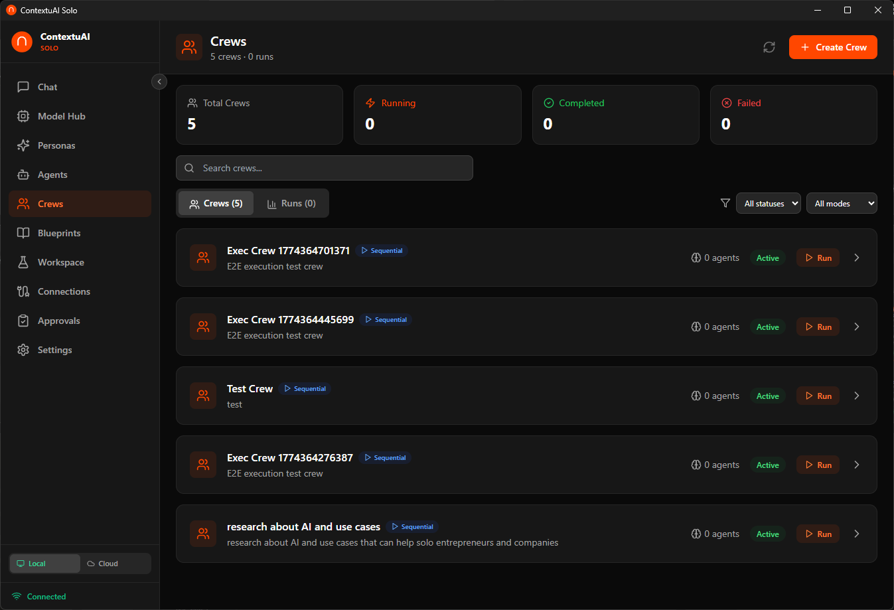
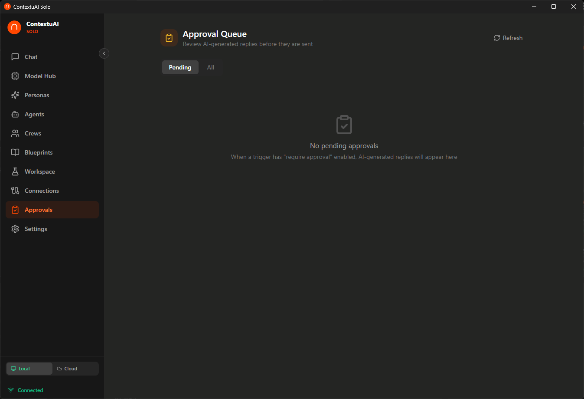

# Video 7: Crews — Multi-Agent Teams

> **Director's Context:** Crews are ContextuAI Solo's most powerful feature — multi-agent teams that collaborate on complex tasks. Users build a crew using a 5-step wizard: Details, Execution Mode, Agent Team, Connections, Review. Execution modes: Sequential (agents work in order), Parallel (all at once), Pipeline (output chains), Autonomous (AI decides). Crews can publish to social channels (Telegram, Discord, LinkedIn, Twitter/X, Instagram, Facebook) with optional approval workflows. This is the feature that turns Solo from a chat app into a business automation platform.

**Duration:** 4 minutes
**Goal:** Walk through crew creation and show a live execution with real-time agent progress.

---

## Opening (0:00 - 0:15)

**On screen:** Crew dashboard showing existing crews with status indicators

**Voiceover:**
> "Crews are where Solo gets serious. One agent is useful. A team of agents working together? That's a business engine. Let's build one."

---

## Scene 1: Step 1 — Crew Details (0:15 - 0:45)

**On screen:** Crew Builder wizard → Step 1: name, description, blueprint selection, model

**Voiceover:**
> "Step 1 — give your crew a name and description. Optionally pick a blueprint to pre-load a workflow. Choose an AI model — this applies to all agents in the crew. For this demo, let's build a 'Weekly Content Pipeline' crew using the Content Calendar blueprint."

---

## Scene 2: Step 2 — Execution Mode (0:45 - 1:15)

**On screen:** Four execution mode cards with visual diagrams

**Voiceover:**
> "Step 2 — how should your agents collaborate? Sequential means agent 1 finishes, passes output to agent 2, then agent 3. Like an assembly line. Parallel runs everyone at once — fast but independent. Pipeline chains outputs where each agent builds on the previous result. And Autonomous — the AI decides the workflow dynamically. For content creation, Sequential is usually best — research first, then write, then edit."

**Key point for NotebookLM:** This is a key decision. Use visual metaphors — assembly line for Sequential, brainstorm room for Parallel, relay race for Pipeline, self-driving car for Autonomous.

---

## Scene 3: Step 3 — Agent Team (1:15 - 1:55)

**On screen:** Agent selection grid → add Trend Analyst, Content Strategist, Copywriter, SEO Specialist

**Voiceover:**
> "Step 3 — pick your team from the 93-agent library. For our content pipeline: Trend Analyst researches what's hot. Content Strategist plans the content angle. Copywriter drafts the post. SEO Specialist optimizes it. Drag to reorder — the sequence matters in Sequential mode. Each agent brings its specialized system prompt to the task."

---

## Scene 4: Step 4 — Connections (1:55 - 2:25)

**On screen:** Toggle social channels — enable LinkedIn, Twitter/X, set approval required

**Voiceover:**
> "Step 4 — where should this crew publish? Toggle on LinkedIn, Twitter, Telegram, Discord, Instagram, or Facebook. For each channel, you can require approval — meaning the crew drafts the post but waits for your OK before publishing. Smart default for anything client-facing."

---

## Scene 5: Step 5 — Review & Run (2:25 - 2:50)

**On screen:** Review summary → Click "Create Crew" → crew runs with real-time progress

**Voiceover:**
> "Step 5 — review everything and launch. You'll see each agent light up as it starts working. The Trend Analyst runs first, passes its findings to the Content Strategist, who passes the plan to the Copywriter, who hands off to the SEO Specialist. Real-time progress for every step."

---

## Scene 6: Approval Workflow (2:50 - 3:40)

**On screen:** Crew finishes → approval notification → review draft → approve/reject → published

**Voiceover:**
> "When the crew finishes, you get an approval notification for each connected channel. Review the drafted LinkedIn post — edit if needed — then approve. Solo publishes it through your connected account. You stay in control of every piece of content that goes out."

**Key point for NotebookLM:** The approval workflow is critical for trust. Nobody wants AI posting to their LinkedIn without review. Emphasize that this is human-in-the-loop by design.

---

## Closing (3:40 - 4:00)

**Voiceover:**
> "Crews turn Solo into a content machine, research team, or analysis pipeline — all running privately on your desktop. Next up: Workspace."

**End card:** "Next: Workspace — Run Projects" + Subscribe/Follow CTA
