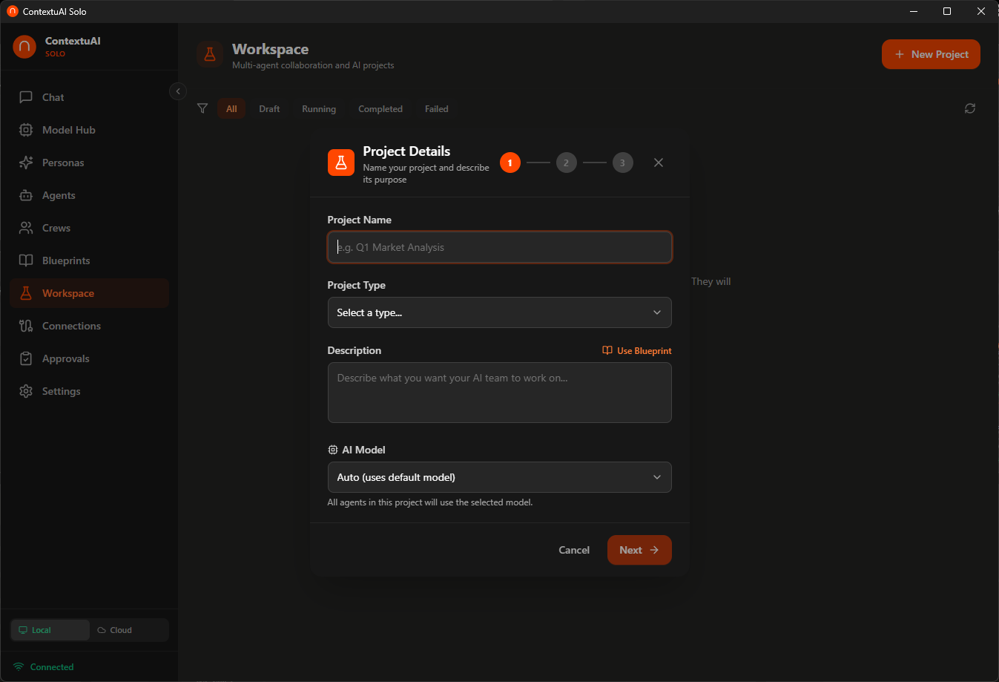

# Video 8: Workspace — Run Projects

> **Director's Context:** Workspace is ContextuAI Solo's project management feature. Users create projects, assign agents, and execute them to produce structured deliverables. Results appear in two tabs: Discussion (individual agent contributions, like a meeting transcript) and Compiled Output (the final merged deliverable). Workspace is for deep, multi-step analysis — unlike Crews which are more about content creation and publishing. Think of Workspace as your private research lab.

**Duration:** 3 minutes
**Goal:** Show the full project lifecycle — create, execute, review Discussion vs Compiled Output.

---

## Opening (0:00 - 0:10)

**On screen:** Workspace page showing project cards

**Voiceover:**
> "Workspace is where you run deep projects — research, analysis, strategy. Let's see it in action."

---

## Scene 1: Creating a Project (0:10 - 0:50)

**On screen:** Click "New Project" → name, description, optional blueprint, select agents

**Voiceover:**
> "Click 'New Project'. Give it a name — 'Q2 Competitive Analysis'. Add a description of what you want. Optionally pick a blueprint for structure. Then select your agents — a Competitive Intelligence Analyst, a Data Analyst, and a Trend Analyst. Each one will contribute their expertise to the project."

**Key point for NotebookLM:** Workspace projects are different from Crews. Crews are about execution and publishing. Workspace is about research and analysis — producing documents, not social posts.

---

## Scene 2: Running a Project (0:50 - 1:25)

**On screen:** Click "Execute" → agents start working → progress indicators

**Voiceover:**
> "Hit Execute and watch your agents go to work. Each agent tackles the project from their specialty — the Intelligence Analyst maps competitors, the Data Analyst digs into numbers, the Trend Analyst spots market movements. You can see real-time progress as each agent completes their analysis."

---

## Scene 3: Discussion Tab (1:25 - 2:00)

**On screen:** Click Discussion tab → show individual agent contributions as conversation

**Voiceover:**
> "When the project finishes, you get two views. The Discussion tab shows each agent's individual contribution — like reading the transcript of a meeting. The Competitive Intelligence Analyst presents their findings, the Data Analyst shares their numbers, the Trend Analyst adds context. You can see exactly what each agent contributed and how they approached the problem."

---

## Scene 4: Compiled Output (2:00 - 2:35)

**On screen:** Click Compiled Output tab → show the final merged deliverable

**Voiceover:**
> "The Compiled Output tab is where it all comes together — a single, structured deliverable that merges all agent contributions into one document. This is what you copy into your presentation, share with your team, or use as the basis for your next decision. It's formatted, organized, and ready to use."

**Key point for NotebookLM:** The two-tab system is powerful. Discussion is for understanding the reasoning. Compiled Output is for the deliverable. Most users will jump straight to Compiled Output, but the Discussion is invaluable when you need to trace how a conclusion was reached.

---

## Scene 5: Managing Projects (2:35 - 2:50)

**On screen:** Show project portfolio — re-run, archive, compare outputs

**Voiceover:**
> "All your projects are saved. Re-run them with updated data, compare outputs across runs, or archive completed work. Your entire analysis history stays local and private."

---

## Closing (2:50 - 3:00)

**Voiceover:**
> "Workspace turns Solo into your private research lab — deep analysis with multiple AI experts, all on your desktop. Next up: Connections."

**End card:** "Next: Connections — Social Publishing" + Subscribe/Follow CTA
